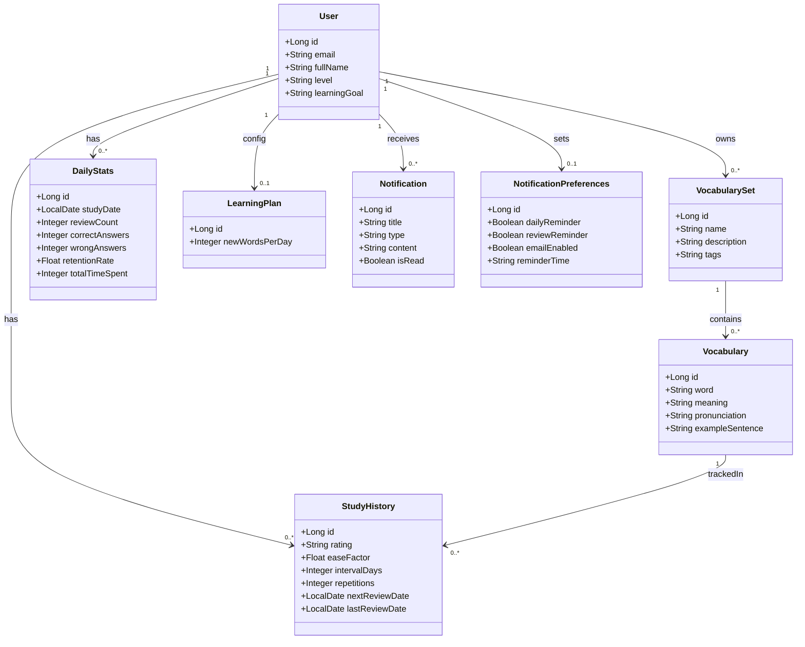
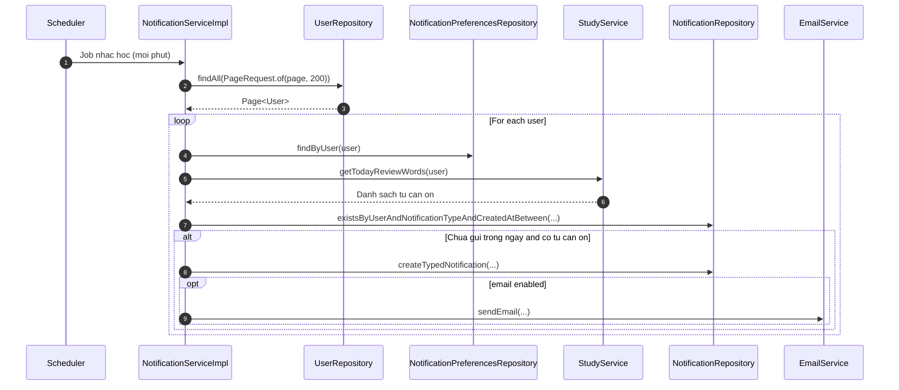
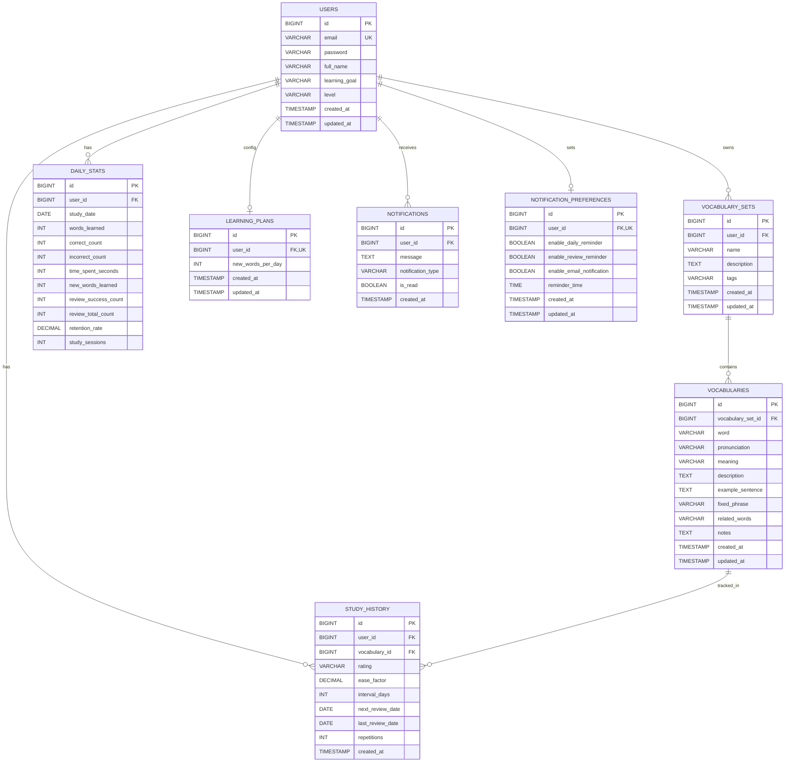
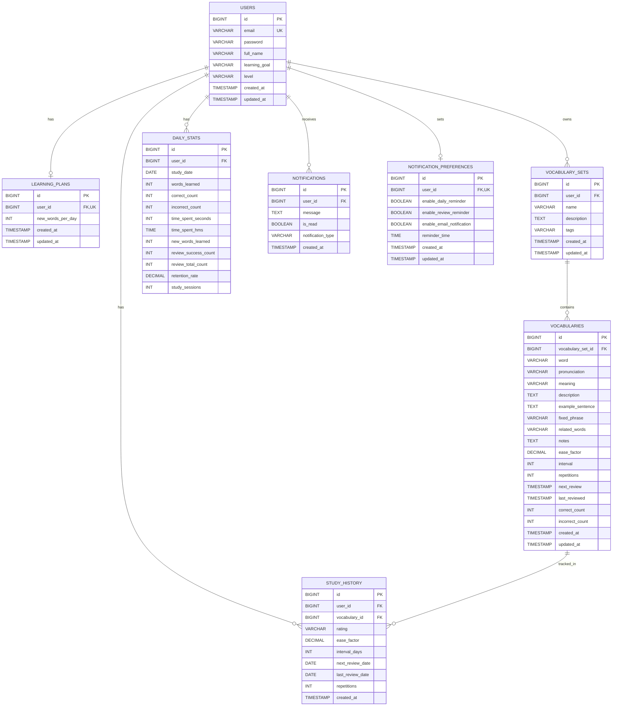

# BAO CAO CUOI MON

## DE TAI: MINLISH - HE THONG HO TRO HOC TU VUNG TIENG ANH

### Thong tin chung
- Sinh vien thuc hien: [Ho ten sinh vien]
- MSSV: [Ma so sinh vien]
- Lop: [Ten lop]
- Giang vien huong dan: [Ho ten giang vien]
- Don vi: [Ten khoa/truong]

---

## LOI MO DAU

Trong bối cảnh hội nhập quốc tế, tiếng Anh ngày càng giữ vai trò quan trọng trong học tập, nghiên cứu và công việc. Đối với người học tiếng Anh, vốn từ vựng là nền tảng để phát triển kỹ năng đọc, viết, nghe và nói. Tuy nhiên, quá trình học từ vựng trong thực tế thường gặp nhiều hạn chế như ghi nhớ không bền vững, thiếu lịch ôn tập khoa học, không theo dõi được tiến độ học tập và dễ mất động lực khi học kéo dài.

Xuất phát từ thực tế đó, đề tài MinLish được xây dựng như một hệ thống hỗ trợ học từ vựng tiếng Anh theo hướng cá nhân hóa. Hệ thống kết hợp quản lý học liệu, flashcard, quiz, thống kê tiến độ và cơ chế nhắc học thông minh. Điểm cốt lõi của hệ thống là áp dụng thuật toán spaced repetition SM-2 để xác định thời điểm ôn tập phù hợp cho từng từ vựng, từ đó tăng khả năng ghi nhớ lâu dài.

Báo cáo này trình bày quá trình phân tích yêu cầu, thiết kế hệ thống, mô tả cơ sở dữ liệu, triển khai các module chính và đánh giá kết quả thực hiện. Nội dung được đối chiếu với mã nguồn thực tế của dự án MinLish nhằm đảm bảo tính nhất quán giữa tài liệu và sản phẩm.

---

## CHUONG 1: TONG QUAN DE TAI

### 1.1. Muc tieu de tai

Mục tiêu của MinLish là xây dựng một nền tảng học từ vựng có khả năng hỗ trợ người học trong toàn bộ vòng đời học tập, từ tạo học liệu cho đến ôn tập và theo dõi tiến độ. Cụ thể, hệ thống hướng tới các mục tiêu sau:

- Quản lý tài khoản người dùng và thông tin cá nhân.
- Tổ chức học liệu theo bộ từ và từ vựng.
- Hỗ trợ học flashcard theo SRS.
- Tạo bài quiz để củng cố kiến thức.
- Thống kê tiến độ học tập theo nhiều chỉ số.
- Gửi notification và email nhắc học, nhắc ôn.

Về mặt kỹ thuật, hệ thống được thiết kế theo mô hình client-server, tách biệt rõ frontend và backend. Backend sử dụng JWT để bảo vệ các API riêng tư, đồng thời kết hợp OAuth2 cho đăng nhập bên thứ ba và SMTP cho gửi email thông báo. Cách tổ chức này giúp hệ thống dễ bảo trì, dễ mở rộng và phù hợp với nhu cầu thực tế của một ứng dụng học tập cá nhân hóa.

### 1.2. Pham vi nghien cuu

Phạm vi của đề tài tập trung vào ứng dụng web. Các chức năng nằm trong phạm vi gồm:

- Đăng ký, đăng nhập và quản lý hồ sơ.
- Quản lý bộ từ và từ vựng.
- Học flashcard theo SM-2.
- Quiz luyện tập.
- Dashboard và thống kê.
- Notification và learning plan.

Các chức năng như thanh toán, mạng xã hội, chia sẻ công khai, mobile app hoặc AI sinh nội dung nâng cao không nằm trong phạm vi chính của đề tài. Những nội dung này chỉ được xem là định hướng mở rộng trong tương lai.

### 1.3. Doi tuong su dung

Hệ thống được xây dựng cho các nhóm người dùng sau:

- Học sinh, sinh viên học tiếng Anh.
- Người luyện thi IELTS, TOEIC, TOEFL.
- Người đi làm cần học từ vựng theo chủ đề phục vụ công việc và giao tiếp.

### 1.4. Phuong phap thuc hien

Quá trình thực hiện đề tài được triển khai theo các bước:

1. Khảo sát vấn đề và xác định nhu cầu người học.
2. Nghiên cứu thuật toán SM-2 và mô hình spaced repetition.
3. Phân tích nghiệp vụ, xác định API và thiết kế dữ liệu.
4. Thiết kế kiến trúc hệ thống, UML và ERD.
5. Triển khai backend, frontend và các module chức năng.
6. Kiểm thử, rà soát và đồng bộ tài liệu với mã nguồn.

### 1.5. Cong nghe su dung

Hệ thống sử dụng các công nghệ chính sau:

- Frontend: React, TypeScript, Vite, TailwindCSS, shadcn/ui.
- Backend: Java 21, Spring Boot 3.3.3, Spring Security, Spring Data JPA, Hibernate.
- Cơ sở dữ liệu: MySQL.
- Xác thực và bảo mật: JWT, OAuth2 Google/GitHub.
- Tích hợp khác: SMTP cho email và scheduler cho tác vụ định kỳ.

---

## CHUONG 2: PHAN TICH YEU CAU HE THONG

### 2.1. Bai toan nghiep vu

Bài toán của MinLish xuất phát từ thực tế người học thường không ghi nhớ được từ vựng lâu dài và không biết nên ôn tập từ nào, vào thời điểm nào. Nếu chỉ học theo cảm tính, người học rất dễ rơi vào trạng thái học xong quên nhanh, dẫn đến hiệu quả học tập thấp.

MinLish giải quyết vấn đề này bằng cách lưu trạng thái học của từng từ, xác định thời điểm ôn dựa trên kết quả đánh giá của người dùng và tự động nhắc học khi từ sắp đến hạn. Ngoài ra, hệ thống còn thống kê tiến độ để người học có thể nhìn thấy kết quả theo ngày và theo giai đoạn.

### 2.2. Use case

flowchart LR
    subgraph System["SRS Vocabulary Learning System"]
        Login(["Login"])
        Profile(["Manage Profile"])
        VocabSets(["Manage Vocabulary Sets"])
        Dashboard(["View Dashboard"])
        Plan(["Manage Learning Plan"])
        Notif(["Manage Notifications"])
        LoginGoogle(["Login with Google"])
        ForgotPass(["Forgot Password"])
        SetDetails(["View Set Details"])
        AddWord(["Add Word"])
        ImportWord(["Import Words"])
        ExportWord(["Export Words"])
        Quiz(["Take Quiz"])
        Flashcard(["Learn with Flashcards SRS"])
    end
    
    User["🧑 User"] --- Profile & VocabSets & Dashboard & Plan & Notif
    
    Dashboard -. "«include»" .-> Login
    Plan -. "«include»" .-> Login
    Profile -. "«include»" .-> Login
    VocabSets -. "«include»" .-> Login
    SetDetails -. "«include»" .-> VocabSets
    Notif -. "«include»" .-> Login
    
    LoginGoogle -. "«extend»" .-> Login
    ForgotPass -. "«extend»" .-> Login
    AddWord -. "«extend»" .-> SetDetails
    ImportWord -. "«extend»" .-> SetDetails
    ExportWord -. "«extend»" .-> SetDetails
    Quiz -. "«extend»" .-> SetDetails
    Flashcard -. "«extend»" .-> SetDetails

    User@{ shape: rect}
    Login:::usecase
    Profile:::usecase
    VocabSets:::usecase
    Dashboard:::usecase
    Plan:::usecase
    Notif:::usecase
    LoginGoogle:::usecase
    ForgotPass:::usecase
    SetDetails:::usecase
    AddWord:::usecase
    ImportWord:::usecase
    ExportWord:::usecase
    Quiz:::usecase
    Flashcard:::usecase
    User:::actor
    
    classDef actor fill:#e3f2fd,stroke:#1976d2,stroke-width:2px,color:#1976d2
    classDef usecase fill:#ffffff,stroke:#333,stroke-width:2px,color:#000
    classDef system fill:#f4f6f9,stroke:#0056b3,stroke-width:2px,stroke-dasharray: 5 5

### 2.3. Yeu cau chuc nang

#### 2.3.1. Quan ly tai khoan

Người dùng có thể đăng ký bằng email và mật khẩu, đăng nhập bằng email/password hoặc Google OAuth2, xem profile và cập nhật thông tin cá nhân. Sau khi đăng ký, hệ thống tạo sẵn notification preferences mặc định để người dùng có thể sử dụng ngay các chức năng nhắc học.

#### 2.3.2. Quan ly bo tu va tu vung

Người dùng có thể tạo nhiều bộ từ theo chủ đề, sau đó thêm, sửa, xóa từ vựng trong từng bộ. Mỗi từ có thể lưu pronunciation, meaning, example sentence, fixed phrase, related words và notes. Hệ thống cũng hỗ trợ import/export dữ liệu để người dùng nhập học liệu nhanh hơn.

#### 2.3.3. Hoc flashcard va SRS

Khi người dùng bắt đầu học, hệ thống lấy ra danh sách từ cần ôn trong ngày. Sau mỗi lần đánh giá, backend cập nhật StudyHistory theo SM-2, điều chỉnh repetitions, intervalDays, easeFactor và nextReviewDate. Đây là phần lõi của toàn bộ hệ thống học từ vựng.

#### 2.3.4. Quiz va tong ket phien hoc

Quiz được triển khai chủ yếu ở frontend để tạo trải nghiệm tương tác nhanh. Sau khi kết thúc phiên học, hệ thống có thể tạo session summary notification nhằm tổng kết kết quả học tập.

#### 2.3.5. Thong ke va bao cao

Dashboard của hệ thống cung cấp các chỉ số như tổng số từ đã học, tổng số lượt học, accuracy, retention rate, số ngày streak và số phiên học. Những thông tin này giúp người học theo dõi tiến độ và điều chỉnh chiến lược học tập.

#### 2.3.6. Notification va learning plan

Notification module chịu trách nhiệm lưu thông báo, đếm thông báo chưa đọc, đánh dấu đã đọc, gửi nhắc học và tạo tổng kết phiên học. Learning plan module cho phép người dùng đặt mục tiêu học mỗi ngày và theo dõi số từ mới đã học, số từ ôn và số từ đến hạn ôn.

### 2.4. Yeu cau phi chuc nang

Hệ thống cần đáp ứng các yêu cầu phi chức năng sau:

- Bảo mật: JWT, bcrypt, CORS và phân quyền endpoint.
- Hiệu năng: xử lý được nhiều request đồng thời.
- Khả dụng: giao diện rõ ràng, responsive và dễ dùng.
- Bảo trì: cấu trúc module hóa, tách lớp rõ ràng.
- Mở rộng: dễ bổ sung gamification, push notification hoặc mobile app.

### 2.5. Quy tac nghiep vu cot loi

Một số quy tắc nghiệp vụ quan trọng của hệ thống gồm:

- Mỗi user chỉ được thao tác trên dữ liệu của chính mình.
- Rating hợp lệ chỉ gồm again, hard, good và easy.
- Mỗi cặp user-vocabulary chỉ có một StudyHistory.
- Mỗi user mỗi ngày chỉ có một DailyStats.
- Reminder không được gửi trùng trong cùng một ngày.
- Giờ nhắc phải theo định dạng HH:mm.

### 2.6. Ma tran yeu cau va module thuc hien

| Mã yêu cầu | Nội dung | Module chính |
|---|---|---|
| F1 | Đăng ký, đăng nhập, profile | AuthController, UserController, UserService |
| F2 | Quản lý bộ từ | VocabularySetController, VocabularySetService |
| F3 | Quản lý từ vựng, import/export | VocabularyController, VocabularyService |
| F4 | Học SRS | StudyController, StudyService |
| F5 | Quiz và tổng kết phiên | Frontend Learn/Quiz, NotificationController |
| F6 | Dashboard và retention | StatsController, StatsService |
| F7 | Notification và preferences | NotificationController, NotificationService |
| F8 | Learning plan cá nhân | LearningPlanController, LearningPlanService |

### 2.7. Mo ta cac luong nghiep vu chinh

#### 2.7.1. Dang ky va dang nhap

Khi người dùng đăng ký, frontend gửi thông tin sang `POST /api/auth/register`. Backend kiểm tra trùng email, mã hóa mật khẩu bằng bcrypt, lưu user mới vào cơ sở dữ liệu và tạo notification preferences mặc định. Sau đó hệ thống trả về JwtResponse để frontend lưu token và tiếp tục sử dụng các API riêng tư.

Khi người dùng đăng nhập, frontend gọi `POST /api/auth/login`. Backend xác thực bằng AuthenticationManager, tạo JWT nếu thông tin hợp lệ và trả về thông tin người dùng. Với Google login, backend kiểm tra token từ Google rồi tìm hoặc tạo user tương ứng.

#### 2.7.2. Quan ly hoc lieu

Mỗi bộ từ thuộc về một user cụ thể. Người dùng có thể tạo bộ từ, thêm từ vựng, chỉnh sửa nội dung hoặc xóa dữ liệu không còn dùng đến. Các chức năng import/export giúp hệ thống xử lý dữ liệu học liệu nhanh hơn và phù hợp với nhu cầu người học muốn chuyển dữ liệu từ nguồn khác vào MinLish.

#### 2.7.3. Hoc va on tap

Khi người dùng vào màn hình học, frontend lấy danh sách từ đến hạn ôn. Sau khi người dùng đánh giá một từ, StudyService cập nhật StudyHistory, tính toán lại lịch ôn và đồng bộ DailyStats. Cách xử lý này giúp hệ thống luôn phản ánh chính xác trạng thái học tập hiện tại.

#### 2.7.4. Thong ke va nhac hoc

Dashboard lấy dữ liệu từ DailyStats và StudyHistory để tính các chỉ số tổng hợp. Scheduler chạy định kỳ để kiểm tra những từ đến hạn ôn và cấu hình nhắc học của người dùng. Nếu email notification được bật, hệ thống gửi thêm email qua EmailService.

---

## CHUONG 3: THIET KE HE THONG

### 3.1. Kien truc tong the

MinLish được xây dựng theo mô hình client-server. Frontend chịu trách nhiệm hiển thị giao diện và gọi API; backend xử lý nghiệp vụ, bảo mật và truy cập dữ liệu; cơ sở dữ liệu lưu trạng thái học tập và các thông tin quan trọng. Kiến trúc này giúp hệ thống dễ bảo trì, dễ mở rộng và phù hợp với mô hình ứng dụng học tập cá nhân hóa.

flowchart TD
    %% Định nghĩa các Users
    PublicUser(("Public Users"))
    AuthUser(("Authenticated Users"))

    %% Tầng Frontend
    subgraph FrontendGroup ["Frontend Applications"]
        direction LR
        Website["<b>MinLish Website</b><br/>Port 2910<br/>React + TypeScript + Vite<br/>Tailwind + UI components"]
        Portal["<b>MinLish App Portal</b><br/>Dashboard / Learn / Quiz<br/>Vocabulary Sets / Profile<br/>ProtectedRoute + JWT<br/>CRUD + Study flows"]
    end

    %% Tầng API Endpoints
    subgraph APIGroup ["API Endpoints"]
        direction LR
        PublicAPI["<b>Public APIs</b><br/>/api/auth/register<br/>/api/auth/login<br/>/api/auth/google"]
        ProtectedAPI["<b>Protected APIs (JWT)</b><br/>/api/users/*, /api/sets/*<br/>/api/vocabularies/*, /api/study/*<br/>/api/stats/*, /api/notifications/*"]
    end

    %% Tầng Backend Services
    subgraph BackendGroup ["Backend Services"]
        direction LR
        SpringBoot["<b>Spring Boot API</b><br/>Port 8080<br/>Spring Boot 3.3.3 / Java 21<br/>Spring Security + JWT filter<br/>Validation + GlobalExceptionHandler"]
        ServiceLayer["<b>Service + Domain Layer</b><br/>Auth, User, VocabularySet, Vocabulary<br/>Study (SM-2), Stats, Notification, LearningPlan<br/>Scheduler jobs + EmailService<br/>OAuth2 and SMTP integrations"]
    end

    %% Tầng Database
    subgraph DBGroup ["Database Tables"]
        MySQL["<b>Core Tables (MySQL)</b><br/>users, vocabulary_sets, vocabularies<br/>study_history, daily_stats, learning_plans<br/>notifications, notification_preferences<br/>JPA/Hibernate via Spring Data Repositories"]
    end

    %% Dịch vụ bên ngoài (External Services)
    subgraph ExternalGroup ["External Services"]
        direction LR
        Google["<b>Google OAuth2</b><br/>social login<br/>token verify"]
        SMTP["<b>SMTP Server</b><br/>email reminders<br/>session summaries"]
    end

    %% Các luồng kết nối (Arrows)
    PublicUser --> Website
    AuthUser --> Portal

    Website --> PublicAPI
    Portal --> ProtectedAPI
    Portal --> PublicAPI

    PublicAPI --> SpringBoot
    ProtectedAPI --> SpringBoot

    SpringBoot --> ServiceLayer

    ServiceLayer --> MySQL
    ServiceLayer --> Google
    ServiceLayer --> SMTP

    %% Định dạng màu sắc (CSS Classes)
    classDef frontend fill:#e6f4ea,stroke:#34a853,stroke-width:2px,color:#000
    classDef portal fill:#fef7e0,stroke:#fbbc04,stroke-width:2px,color:#000
    classDef apiPublic fill:#e6f4ea,stroke:#34a853,stroke-width:2px,color:#000
    classDef apiProtected fill:#fce8e6,stroke:#ea4335,stroke-width:2px,color:#000
    classDef backendApi fill:#e8f0fe,stroke:#4285f4,stroke-width:2px,color:#000
    classDef backendLayer fill:#e6f4ea,stroke:#34a853,stroke-width:2px,color:#000
    classDef db fill:#f1f3f4,stroke:#5f6368,stroke-width:2px,color:#000
    classDef ext fill:#fce8e6,stroke:#ea4335,stroke-width:2px,color:#000
    classDef userNode fill:#f3e8fd,stroke:#ab47bc,stroke-width:2px,color:#000

    %% Áp dụng màu sắc cho các node
    class Website frontend
    class Portal portal
    class PublicAPI apiPublic
    class ProtectedAPI apiProtected
    class SpringBoot backendApi
    class ServiceLayer backendLayer
    class MySQL db
    class Google,SMTP ext
    class PublicUser,AuthUser userNode

### 3.4. Class Diagram



Mô hình trên cho thấy User là thực thể trung tâm của hệ thống. Mỗi user có thể sở hữu nhiều bộ từ, nhiều từ vựng, nhiều lịch sử học và nhiều thông báo. LearningPlan và NotificationPreferences được thiết kế dạng 1-1 với User để lưu cấu hình cá nhân hóa.

### 3.5. Sequence Diagram cho luong chính
# register
sequenceDiagram
    autonumber
    participant U as Người dùng
    participant FE as Frontend (Register)
    participant AuthC as AuthController
    participant UserSvc as UserServiceImpl
    participant UserRepo as UserRepository
    participant PrefRepo as NotificationPreferencesRepository
    participant AuthMgr as AuthenticationManager
    participant JwtProv as JwtTokenProvider

    U->>FE: Nhập thông tin đăng ký (email, password, tên, mục tiêu, level)
    FE->>AuthC: POST /api/auth/register (RegisterRequest)
    AuthC->>UserSvc: registerUser(email, password, fullName, learningGoal, level)
    UserSvc->>UserRepo: existsByEmail(email)
    UserSvc->>UserRepo: save(user mới)
    UserSvc->>PrefRepo: save(notification preferences mặc định)
    UserSvc-->>AuthC: Trả về User
    AuthC->>AuthMgr: authenticate(email, password)
    AuthC->>JwtProv: generateToken(authentication)
    AuthC-->>FE: Trả về JWT (access token) + thông tin user
    FE: Lưu token, chuyển sang giao diện chính
# login google
sequenceDiagram
    autonumber
    participant U as Người dùng
    participant FE as Frontend (React)
    participant Google as Google OAuth Server
    participant AuthC as AuthController
    participant UserSvc as UserService

    U->>FE: Bấm nút "Đăng nhập bằng Google"
    FE->>Google: Yêu cầu xác thực (popup/chuyển hướng)
    Google-->>FE: Trả về Google Token (ID Token hoặc Access Token)
    FE->>AuthC: POST /api/auth/google (gửi token)
    AuthC->>Google: Xác thực token qua API Google
    Google-->>AuthC: Trả về thông tin email, name, avatar...
    AuthC->>UserSvc: findOrCreateGoogleUser(email, name)
    UserSvc->>UserSvc: Nếu chưa có thì tạo user mới, gán thông tin mặc định
    UserSvc-->>AuthC: Trả về User
    AuthC->>FE: Trả về JWT (Access Token) + thông tin user
    FE->>U: Đăng nhập thành công, chuyển vào trang chủ
# dashboard
sequenceDiagram
    autonumber
    participant U as Người dùng
    participant FE as Frontend (Dashboard)
    participant API as Backend (StatsController, StatsService, Repo)

    U->>FE: Mở trang Dashboard
    FE->>API: GET /api/stats/summary
    API-->>FE: Trả về tổng số từ đã học, số lượt học, streak, thời gian học, accuracy, retention rate, v.v.

    FE->>API: GET /api/stats/daily?start=...&end=...
    API-->>FE: Trả về thống kê từng ngày (số lượt học, từ mới, thời gian, retention...)

    FE->>API: GET /api/stats/retention-rate/daily (hoặc weekly/monthly)
    API-->>FE: Trả về dữ liệu retention rate theo ngày/tuần/tháng

    FE: Hiển thị các chỉ số, biểu đồ tiến độ, retention, streak, v.v. cho người dùng
# learning plan
sequenceDiagram
    autonumber
    participant U as Người dùng
    participant FE as Frontend (Learning Plan)
    participant LPController as LearningPlanController
    participant LPService as LearningPlanServiceImpl
    participant LPRepo as LearningPlanRepository
    participant StatsRepo as DailyStatsRepository
    participant SHRepo as StudyHistoryRepository

    U->>FE: Mở trang Learning Plan
    FE->>LPController: GET /api/learning-plan
    LPController->>LPService: getCurrentPlan(user)
    LPService->>LPRepo: findByUser(user)
    LPService->>StatsRepo: findByUserAndStudyDate(user, today)
    LPService->>SHRepo: countByUserAndNextReviewDateLessThanEqual(user, today)
    LPService-->>LPController: Tổng hợp chỉ số (mục tiêu/ngày, đã học, từ ôn, từ đến hạn)
    LPController-->>FE: Trả về LearningPlanDTO

    U->>FE: Đổi mục tiêu/ngày
    FE->>LPController: PUT /api/learning-plan (new target)
    LPController->>LPService: updatePlan(user, request)
    LPService->>LPRepo: findByUser(user) hoặc tạo mới
    LPService->>LPRepo: save(plan)
    LPService->>StatsRepo: findByUserAndStudyDate(user, today)
    LPService->>SHRepo: countByUserAndNextReviewDateLessThanEqual(user, today)
    LPService-->>LPController: Tổng hợp chỉ số mới
    LPController-->>FE: Trả về LearningPlanDTO mới

# notification reviews

# Sequence Diagram: Luồng học SRS flashcard (chuẩn code thực tế)

    ```mermaid
    sequenceDiagram
        autonumber
        participant U as User
        participant FE as Frontend (React)
        participant StudyC as StudyController
        participant StudyS as StudyServiceImpl
        participant HistRepo as StudyHistoryRepository
        participant VocabRepo as VocabularyRepository
        participant StatsRepo as DailyStatsRepository
        participant NotiC as NotificationController
        participant NotiS as NotificationServiceImpl

        U->>FE: Mở màn hình học (Learn)
        FE->>StudyC: GET /api/study/today
        StudyC->>StudyS: getTodayReviewWords(user)
        StudyS->>HistRepo: findByUserAndNextReviewDateLessThanEqual(user, today)
        HistRepo-->>StudyS: Danh sách StudyHistory
        StudyS-->>StudyC: Danh sách Vocabulary cần học
        StudyC-->>FE: 200 OK + study items

        loop Với mỗi từ cần học
            U->>FE: Đánh giá (again/hard/good/easy)
            FE->>StudyC: POST /api/study/rate
            StudyC->>StudyS: processStudyResult(user, request)
            StudyS->>VocabRepo: findById(vocabularyId)
            VocabRepo-->>StudyS: Vocabulary
            StudyS->>HistRepo: findByUserAndVocabulary(user, vocabulary)
            HistRepo-->>StudyS: StudyHistory hoặc empty
            StudyS->>StudyS: Tính SM-2, cập nhật lịch ôn
            StudyS->>HistRepo: save(history)
            StudyS->>StatsRepo: save(DailyStats)
            StudyS-->>StudyC: 200 OK
            StudyC-->>FE: 200 OK
        end

        alt Học xong phiên
            FE->>NotiC: POST /api/notifications/session-summary
            NotiC->>NotiS: createSessionSummary(user, correct, total, timeSpent)
            NotiS->>NotiS: Tạo notification tổng kết
            NotiS-->>NotiC: Notification
            NotiC-->>FE: 200 OK
        end
    ```

### 3.6. ER Diagram



Ghi chu rang buoc quan trong theo schema hien tai: `study_history` co unique `(user_id, vocabulary_id)` va `daily_stats` co unique `(user_id, study_date)`.

### 3.6.1. ER Diagram (theo init.sql 100%)



Ghi chu theo init.sql: `daily_stats.time_spent_hms` la generated column, `study_history` co unique `(user_id, vocabulary_id)`, `daily_stats` co unique `(user_id, study_date)`.

### 3.7. Thiet ke co so du lieu

Cơ sở dữ liệu của hệ thống gồm 8 bảng chính: users, vocabulary_sets, vocabularies, study_history, daily_stats, learning_plans, notifications và notification_preferences.

#### 3.7.1. Bang users

Bảng users lưu thông tin đăng nhập và hồ sơ cơ bản của người dùng, bao gồm email, password, full_name, level, learning_goal, created_at và updated_at. Email được ràng buộc unique để đảm bảo mỗi tài khoản là duy nhất.

#### 3.7.2. Bang vocabulary_sets

Bảng vocabulary_sets lưu các bộ học liệu theo chủ đề. Mỗi bản ghi gắn với một user và bao gồm name, description, tags, created_at và updated_at. Cấu trúc này giúp người học dễ tổ chức học liệu theo mục tiêu cụ thể.

#### 3.7.3. Bang vocabularies

Bảng vocabularies lưu chi tiết từng từ vựng trong một bộ. Ngoài các trường cơ bản như word, meaning và pronunciation, hệ thống còn lưu example sentence, fixed phrase, related words và notes để làm đầy đủ ngữ cảnh học.

#### 3.7.4. Bang study_history

Bảng study_history là trung tâm của cơ chế SRS. Mỗi bản ghi thể hiện tiến độ học của một cặp user-vocabulary, bao gồm rating, ease factor, interval days, next review date, last review date và repetitions. Ràng buộc unique(user_id, vocabulary_id) đảm bảo mỗi user chỉ có một lịch sử học riêng cho từng từ.

#### 3.7.5. Bang daily_stats

Bảng daily_stats lưu thống kê tổng hợp theo ngày, gồm số từ mới, số lượt ôn, số câu đúng/sai, tỷ lệ retention, số phiên học và tổng thời gian học. Ràng buộc unique(user_id, study_date) giúp mỗi user mỗi ngày có một bản ghi thống kê duy nhất.

#### 3.7.6. Bang learning_plans

Bảng learning_plans lưu mục tiêu học mỗi ngày của user. Hiện tại bảng tập trung vào chỉ số newWordsPerDay, nhưng khi trả về DTO, hệ thống có thể tổng hợp thêm số từ mới đã học, số từ ôn và số từ đến hạn ôn để người dùng theo dõi tiến độ trong ngày.

#### 3.7.7. Bang notifications

Bảng notifications lưu các thông báo trong hệ thống, bao gồm session summary, reminder, review due và milestone. Mỗi thông báo gắn với một user và có trạng thái đã đọc/chưa đọc để phục vụ giao diện thông báo và bộ đếm unread.

#### 3.7.8. Bang notification_preferences

Bảng notification_preferences lưu cấu hình thông báo cá nhân của từng user, bao gồm nhắc học hàng ngày, nhắc ôn, gửi email thông báo và giờ nhắc. Thiết kế này giúp hệ thống cá nhân hóa thông báo theo thói quen của từng người học.

### 3.8. Thiet ke API tong quan

#### 3.8.1. Auth

- `POST /api/auth/register`
- `POST /api/auth/login`
- `POST /api/auth/google`

#### 3.8.2. Users

- `GET /api/users/profile`
- `PUT /api/users/profile`

#### 3.8.3. Vocabulary sets

- `POST /api/sets`
- `GET /api/sets`
- `GET /api/sets/{setId}`
- `PUT /api/sets/{setId}`
- `DELETE /api/sets/{setId}`

#### 3.8.4. Vocabularies

- `POST /api/vocabularies/set/{setId}`
- `GET /api/vocabularies/set/{setId}`
- `PUT /api/vocabularies/{vocabId}`
- `DELETE /api/vocabularies/{vocabId}`
- `POST /api/vocabularies/import/{setId}`
- `GET /api/vocabularies/export/{setId}`

#### 3.8.5. Study

- `GET /api/study/today`
- `POST /api/study/rate`
- `GET /api/study/due-review-sets`

#### 3.8.6. Stats

- `GET /api/stats/summary`
- `GET /api/stats/daily`
- `GET /api/stats/retention-rate/daily`
- `GET /api/stats/retention-rate/weekly`
- `GET /api/stats/retention-rate/monthly`
- `GET /api/stats/review-due-sets`

#### 3.8.7. Notifications

- `GET /api/notifications`
- `GET /api/notifications/recent`
- `GET /api/notifications/unread-count`
- `PUT /api/notifications/{id}/read`
- `POST /api/notifications/session-summary`
- `GET /api/notifications/preferences`
- `PUT /api/notifications/preferences`

#### 3.8.8. Learning plan

- `GET /api/learning-plan`
- `PUT /api/learning-plan`

### 3.9. Bao mat he thong

Hệ thống áp dụng các cơ chế bảo mật cơ bản sau:

- Xác thực người dùng bằng JWT.
- Mã hóa mật khẩu bằng bcrypt.
- Phân quyền endpoint private bằng Spring Security.
- Kiểm tra quyền sở hữu trước khi sửa/xóa dữ liệu.
- Cấu hình CORS cho frontend ở môi trường local và triển khai.

---

## CHUONG 4: TRIEN KHAI VA KIEM THU

### 4.1. To chuc source code

Backend được tổ chức theo package `com.minlish` với các nhóm chức năng chính: `config`, `controller`, `dto`, `entity`, `exception`, `repository`, `service` và `util`. Frontend được tổ chức theo các nhóm `pages`, `components`, `hooks` và `lib` để tách biệt giao diện, logic chia sẻ và tầng giao tiếp API.

### 4.2. Trien khai cac chuc nang chinh

#### 4.2.1. User management

Module tài khoản bao gồm đăng ký, đăng nhập, cập nhật profile và đăng nhập Google. Sau khi đăng ký, hệ thống tạo sẵn notification preferences để người dùng có thể sử dụng ngay các tính năng nhắc học. Luồng xác thực được triển khai theo JWT nên phù hợp với kiến trúc stateless của REST API.

#### 4.2.2. Vocabulary management

Người dùng có thể tạo bộ từ theo chủ đề, thêm từ vựng và import học liệu từ tệp. Khi export, hệ thống sinh file CSV UTF-8 để dễ mở trên nhiều công cụ. Các trường nội dung như example sentence, fixed phrase và related words giúp từ vựng được lưu theo ngữ cảnh đầy đủ hơn.

#### 4.2.3. Study engine

Study engine là phần trung tâm của hệ thống. Mỗi lần người dùng đánh giá một từ, backend tính lại repetitions, interval_days, ease_factor và next_review_date. Kết quả được lưu vào study_history và đồng bộ daily_stats. Đây là thành phần quyết định trực tiếp đến hiệu quả ghi nhớ của hệ thống.

#### 4.2.4. Quiz module

Quiz được frontend vận hành chủ yếu, dùng học liệu đã có để tạo câu hỏi. Sau khi kết thúc phiên, frontend tổng kết kết quả và có thể gửi API session summary để lưu thông báo. Thiết kế này giúp trải nghiệm người dùng mượt hơn mà vẫn giữ được tính nhất quán dữ liệu ở backend.

#### 4.2.5. Analytics module

Dashboard tổng hợp các chỉ số cơ bản và phục vụ người dùng theo dõi tiến bộ. Retention được tính theo ngày, tuần và tháng. Những chỉ số này không chỉ mang tính thống kê mà còn giúp người học điều chỉnh nhịp độ và chiến lược học tập.

#### 4.2.6. Notification module

Hệ thống thông báo bao gồm thông báo trong ứng dụng và email reminder. Scheduler chạy định kỳ để kiểm tra từ cần ôn, giờ nhắc và cấu hình của từng user. Khi có sự kiện học tập, hệ thống có thể tạo session summary, reminder hoặc review due notification tùy ngữ cảnh.

#### 4.2.7. Learning plan module

LearningPlan cho phép người dùng đặt mục tiêu học mỗi ngày. Đồng thời, hệ thống tổng hợp dữ liệu từ DailyStats và StudyHistory để trả về số từ mới đã học, số từ ôn và số từ đến hạn ôn. Module này giúp người dùng nhìn thấy rõ tiến độ hàng ngày và duy trì động lực học tập.

### 4.3. Kiem thu chuc nang

Trong quá trình kiểm thử, các nhóm tình năng chính được xác minh theo các kịch bản sau:

- Đăng ký với email hợp lệ và email trùng lặp.
- Đăng nhập đúng/sai mật khẩu.
- Tạo, cập nhật và xóa bộ từ.
- Thêm, sửa, xóa từ vựng.
- Import CSV/XLSX với dữ liệu hợp lệ và không hợp lệ.
- Đánh giá từ với again, hard, good, easy.
- Lấy dữ liệu dashboard và review due.
- Xem danh sách thông báo và đánh dấu đã đọc.
- Lấy và cập nhật learning plan.

Kết quả kiểm thử cho thấy các API chính hoạt động đúng theo yêu cầu nghiệp vụ và đồng bộ tốt với frontend. Các chức năng cơ bản của hệ thống đã được kiểm tra qua các luồng hợp lệ, luồng lỗi và các tình huống biên để đảm bảo độ ổn định.

### 4.4. Danh gia chuc nang theo module

#### 4.4.1. Auth

Đăng ký và đăng nhập hoạt động ổn định, JWT được frontend lưu để gọi API private. Cơ chế đăng nhập Google cũng giúp cải thiện trải nghiệm người dùng khi không cần ghi nhớ thêm một mật khẩu riêng.

#### 4.4.2. Vocabulary

CRUD bộ từ và từ vựng cập nhật đúng vào CSDL, import/export phục vụ nhập học liệu nhanh. Module này giữ vai trò nền tảng cho toàn bộ bài toán học từ vựng, vì nó quyết định chất lượng và tính linh hoạt của học liệu.

#### 4.4.3. Study

SM-2 được áp dụng để điều chỉnh lịch ôn, next_review_date được cập nhật sau mỗi lần đánh giá. Đây là phần logic quan trọng nhất của hệ thống, ảnh hưởng trực tiếp đến chất lượng ghi nhớ.

#### 4.4.4. Analytics

Dashboard và retention phản ánh tiến bộ học tập, daily_stats giúp tổng hợp chỉ số theo ngày. Người học có thể dựa vào đây để xem mình đã học được bao nhiêu, tỷ lệ ghi nhớ ra sao và có cần điều chỉnh nhịp độ học không.

#### 4.4.5. Notification

Session summary và reminder được tạo theo sự kiện, cơ chế mark-as-read và unread-count hỗ trợ giao diện. Module này giúp hệ thống có tính chủ động và tạo động lực học tập liên tục cho người dùng.

#### 4.4.6. Learning plan

Module này giúp người dùng đặt mục tiêu học mỗi ngày và theo dõi số từ mới, số từ ôn, số từ đến hạn ôn trong ngày. Đây là phần bổ trợ cần thiết để hệ thống không chỉ thống kê mà còn hướng người dùng đến mục tiêu rõ ràng.

### 4.5. Danh gia phi chuc nang

#### 4.5.1. Hieu nang

Hệ thống có kiến trúc tách lớp, truy vấn dữ liệu theo module và lưu cache hợp lý cho các thông tin dùng nhiều như unread count. Điều này giúp giảm tải cho frontend và tăng khả năng phục vụ đồng thời.

#### 4.5.2. Bao mat

JWT và bcrypt được sử dụng để bảo vệ tài khoản người dùng. Các endpoint private yêu cầu token hợp lệ, đồng thời backend kiểm tra quyền sở hữu trước khi tác động dữ liệu. CORS được cấu hình đồng bộ giữa SecurityConfig và WebConfig để tránh lỗi truy cập chéo khi frontend và backend chạy ở các domain/port khác nhau.

#### 4.5.3. Kha dung

Frontend được thiết kế theo hướng dễ học, dễ làm quen, có giao diện responsive và flow rõ ràng cho mobile. Các màn hình Learn, Quiz, Dashboard và Notification hỗ trợ người dùng theo dõi tiến bộ liên tục, giảm cảm giác bị động trong quá trình học.

#### 4.5.4. Kha nang mo rong

Kiến trúc module hóa giúp dễ bổ sung các tính năng trong tương lai như gamification, mobile app, push notification hoặc AI gợi ý từ vựng. Cách bố trí này giúp đề tài có khả năng phát triển tiếp mà không phải tái cấu trúc toàn bộ hệ thống.

### 4.6. Cac dich vu ho tro quan trong

#### 4.6.1. Global exception handling

Hệ thống có GlobalExceptionHandler để xử lý lỗi tổng quát và trả response rõ ràng cho frontend. Các lỗi liên quan đến xác thực, phân quyền và không tìm thấy dữ liệu được xử lý riêng để giúp giao diện hiển thị thông điệp nghiệp vụ phù hợp hơn.

#### 4.6.2. Security utilities

SecurityUtils và JwtTokenProvider hỗ trợ lấy thông tin user đang đăng nhập, kiểm tra token và phục vụ luồng xác thực JWT. Đây là thành phần quan trọng để controller có thể truy xuất user hiện tại một cách thống nhất.

#### 4.6.3. SM-2 utility

SM2Util chịu trách nhiệm tính toán các tham số SRS như ease factor, interval và repetitions. Việc tách logic này giúp study service dễ bảo trì, dễ kiểm thử và có thể tái sử dụng khi cần.

### 4.7. Cac luong API tieu bieu

#### 4.7.1. Luong lay hoc lieu can hoc

Frontend gọi `GET /api/study/today`, backend lọc các bản ghi StudyHistory có `nextReviewDate <= ngày hiện tại` và trả về danh sách từ cần ôn. Luồng này giúp người dùng vào học là có ngay các từ cần ôn mà không phải tự tìm thủ công.

#### 4.7.2. Luong danh gia mot tu

Người dùng chọn mức độ ghi nhớ, frontend gọi `POST /api/study/rate`, backend tìm hoặc tạo StudyHistory, tính SM-2, cập nhật lịch ôn và đồng bộ daily_stats. Đây là luồng nghiệp vụ có tác động trực tiếp đến chất lượng toàn hệ thống.

#### 4.7.3. Luong tao session summary

Sau khi kết thúc phiên học, frontend tổng kết dữ liệu và gọi `POST /api/notifications/session-summary`. Backend tạo notification tổng kết, đồng bộ số liệu cần thiết và trả kết quả để hiển thị trên giao diện.

#### 4.7.4. Luong nhac hoc tu dong

Scheduler chạy định kỳ trong `NotificationServiceImpl`. Mỗi lần chạy, hệ thống lấy danh sách user, đọc `NotificationPreferences`, kiểm tra từ đến hạn ôn qua `StudyService.getTodayReviewWords(user)`, tránh gửi trùng trong ngày, rồi tạo notification; nếu user bật email thì gửi thêm email qua `EmailService`.


#### 4.7.5. Luong cap nhat learning plan

Người dùng có thể vào `LearningPlanController` để gọi `GET /api/learning-plan` hoặc `PUT /api/learning-plan`. Backend lấy `LearningPlan` theo user, kết hợp `DailyStats` của ngày hiện tại và số từ đến hạn ôn từ `StudyHistoryRepository`, rồi trả về `LearningPlanDTO` gồm mục tiêu, số từ mới đã học, số từ ôn hôm nay và số từ đến hạn ôn.

### 4.8. Chenh lech giua thiet ke va trien khai

Trong quá trình phát triển, một số tính năng được tổ chức theo hướng thực tế của source code thay vì mô hình lý tưởng. Cụ thể, quiz logic hiện tại vẫn chủ yếu nằm ở frontend; backend tập trung vào study, notification và thống kê. Ngoài ra, learning plan hiện tại được thiết kế gọn, tập trung vào mục tiêu học mỗi ngày và thông tin tổng hợp tiến độ.

---

## CHUONG 5: KET LUAN VA HUONG PHAT TRIEN

### 5.1. Ket luan

Đề tài MinLish đã xây dựng được một hệ thống hỗ trợ học từ vựng tiếng Anh có tính thực tiễn và khả năng áp dụng cao. Hệ thống không chỉ cung cấp công cụ quản lý học liệu, mà còn kết hợp cơ chế ôn tập khoa học, thống kê tiến độ và reminder thông minh để hỗ trợ người học duy trì động lực lâu dài.

Với kiến trúc frontend React và backend Spring Boot, hệ thống có cấu trúc rõ ràng, dễ bảo trì và dễ mở rộng. Cơ sở dữ liệu được thiết kế phù hợp cho bài toán học cá nhân hóa, trong đó các bảng study_history, daily_stats, learning_plans và notifications giữ vai trò trung tâm. Các chức năng xác thực JWT, OAuth2, email notification và scheduler giúp hệ thống gần với nhu cầu sử dụng thực tế.

### 5.2. Gia tri dat duoc
+
+Qua đề tài, một số giá trị nổi bật đã được đạt được:
+
+- Xây dựng được một nền tảng học từ vựng có hệ thống.
+- Áp dụng được cơ chế SM-2 vào luồng ôn tập.
+- Có dashboard và thống kê để đối chiếu hiệu quả học tập.
+- Có reminder và notification để duy trì thói quen học.
+- Có kiến trúc module hóa, phù hợp để phát triển tiếp.
+
+### 5.3. Huong phat trien
+
+Trong giai đoạn tiếp theo, hệ thống có thể được mở rộng theo các hướng sau:
+
+- Phát triển mobile app Android/iOS.
+- Hỗ trợ push notification theo thời gian thực.
+- Bổ sung gamification như huy hiệu, streak rewards và level system.
+- Cải tiến quiz engine để backend có thể tạo câu hỏi động.
+- Bổ sung AI gợi ý từ vựng và cách dùng trong ngữ cảnh.
+- Hỗ trợ đồng bộ đa thiết bị và backup dữ liệu cá nhân.
+
+### 5.4. Loi cam on
+
+Em xin chân thành cảm ơn quý thầy cô và nhà trường đã tạo điều kiện để em hoàn thành đề tài này. Qua quá trình thực hiện, em đã học được nhiều kiến thức thực tế về phân tích hệ thống, thiết kế cơ sở dữ liệu, xây dựng API, bảo mật ứng dụng và tổ chức một sản phẩm web hoàn chỉnh. Những kiến thức này là nền tảng quan trọng cho việc em tiếp tục nghiên cứu và phát triển các ứng dụng phần mềm trong tương lai.
+
+---
+
+## PHU LUC: TOM TAT API VA DU LIEU CHINH
+
+### A. API chinh
+
+- `/api/auth/register`
+- `/api/auth/login`
+- `/api/auth/google`
+- `/api/users/profile`
+- `/api/sets`
+- `/api/vocabularies`
+- `/api/study/today`
+- `/api/study/rate`
+- `/api/stats/summary`
+- `/api/stats/retention-rate/daily`
+- `/api/stats/retention-rate/weekly`
+- `/api/stats/retention-rate/monthly`
+- `/api/notifications`
+- `/api/notifications/recent`
+- `/api/notifications/unread-count`
+- `/api/notifications/preferences`
+- `/api/learning-plan`
+
+### B. Du lieu input tieu bieu
+
+#### Dang ky
+
+```json
+{
+  "email": "user@example.com",
+  "password": "123456",
+  "fullName": "Nguyen Van A",
+  "learningGoal": "IELTS",
+  "level": "B1"
+}
+```
+
+#### Dang nhap
+
+```json
+{
+  "email": "user@example.com",
+  "password": "123456"
+}
+```
+
+#### Bo tu
+
+```json
+{
+  "name": "IELTS Academic",
+  "description": "Tu vung hoc thuat",
+  "tags": "IELTS,Academic"
+}
+```
+
+#### Tu vung
+
+```json
+{
+  "word": "ubiquitous",
+  "pronunciation": "/juːˈbɪk.wɪ.təs/",
+  "meaning": "co mat o khap noi",
+  "description": "present everywhere",
+  "exampleSentence": "Mobile phones are ubiquitous.",
+  "fixedPhrase": "ubiquitous technology",
+  "relatedWords": "omnipresent, pervasive",
+  "notes": "IELTS Band 7+"
+}
+```
+
+### C. Ghi chu ve van hanh
+
+- Backend đang chạy với port được cấu hình qua biến môi trường `PORT`.
+- CORS cần được đồng bộ giữa SecurityConfig và WebConfig khi thay đổi frontend domain.
+- File `init.sql` đang được dùng để nạp dữ liệu mẫu trong môi trường local, vì vậy cần cân nhắc nếu muốn giữ dữ liệu thử nghiệm.
+
+---
+
+## KET LUAN CHUNG
+
+Báo cáo này đã trình bày đầy đủ quá trình phân tích, thiết kế, triển khai và đánh giá của hệ thống MinLish. Hệ thống đã đạt được mục tiêu hỗ trợ học từ vựng theo hướng khoa học, có mức độ cá nhân hóa cao và có khả năng mở rộng tốt. Trên cơ sở đó, đề tài có thể được sử dụng làm nền tảng để phát triển thêm các tính năng nâng cao trong tương lai.
